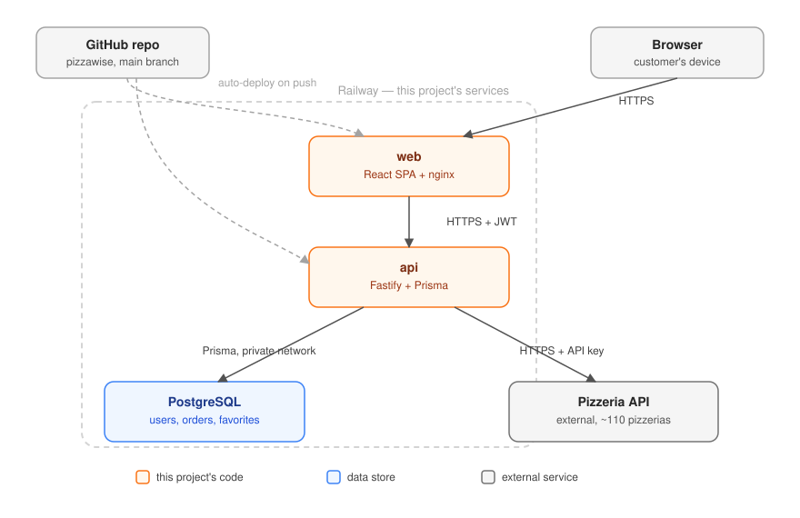

# PizzaWise

A pizza aggregator and custom-order builder: pick a pizza once, and PizzaWise checks it against every nearby pizzeria's real menu, ranks them by actual value (price, distance, and delivery time), and lets you order, save favorites, and track orders.

**Live demo:** https://web-production-80031.up.railway.app
**API health check:** https://api-production-43395.up.railway.app/health
**User guide:** [docs/USER_GUIDE.md](docs/USER_GUIDE.md)

## What it does

- **Guided pizza builder** — a step-by-step wizard (size → crust → sauce → toppings → location) with a live illustration of the pizza as you build it.
- **Smart comparison engine** — fetches the nearest pizzerias' real menus from a live upstream API, normalizes their inconsistent naming, and ranks them by a composite value score blending price, distance, and ETA.
- **Accounts, favorites, and order history** — register/log in, save a pizza configuration as a favorite to reorder later, place an order, and track its (simulated) delivery status over time.
- **Live delivery tracking** — an order's detail page shows an animated status stepper and a map (Leaflet + OpenStreetMap, no API key required) with the pizzeria, the delivery address, and a marker that moves between them as the order progresses — driven by the same elapsed-time-vs-ETA logic the status itself is derived from.

## Architecture

Two independently deployable services, each its own Docker image, talking over HTTP:



- **`web/`** — React + TypeScript + Vite SPA. Talks only to the `api`, never directly to the pizzeria API or the database.
- **`api/`** — Fastify + TypeScript service. Owns all business logic, the database, and the only credentials for the upstream pizzeria API.
- **PostgreSQL** — the only stateful piece; both other services are stateless and horizontally scalable.

This split exists because the two halves have genuinely different concerns and lifecycles: the frontend is pure presentation and can be rebuilt/redeployed independently of business logic changes, and keeping the pizzeria API key and database credentials out of the browser entirely is a real security boundary, not just a style preference.

### Tech stack

| | |
|---|---|
| **API** | Node 22, TypeScript (runs directly via `--experimental-strip-types`, no build step), Fastify 5, Prisma 6 + PostgreSQL, Zod, `@fastify/jwt`, bcryptjs, Pino |
| **Web** | React 19, TypeScript, Vite, Tailwind CSS v4, React Router, TanStack Query, Framer Motion |
| **Infra** | Docker (multi-stage builds), Railway (hosting, Postgres, both services) |

### Why these choices

- **No build step for the API.** Node 22's built-in TypeScript stripping means `.ts` files run directly in both dev and the production container — no compile step, no dist folder, no source maps to keep in sync. For a service this size, a bundler would add complexity without adding value.
- **Prisma over a hand-rolled query layer.** Migrations are version-controlled and applied automatically on container start (`prisma migrate deploy`), so the schema and the code that depends on it can never drift in an environment.
- **Zod at the HTTP boundary only.** Request bodies are validated on the way in; internal domain functions trust their inputs. Validating everywhere would just be repetition.
- **Pure functions for the domain logic.** Pizza matching, size matching, catalog normalization, ranking, and order status are all plain functions with no I/O — see `api/src/domain/`. They're fully unit-tested (34 tests) without needing a database, an HTTP server, or mocks.
- **Order status is derived, not stored.** There's no real kitchen behind this order — `deriveOrderStatus` computes `PLACED → PREPARING → OUT_FOR_DELIVERY → DELIVERED` purely from elapsed time against the pizzeria's ETA. Cancellation is the one real state, stored explicitly.

## The smart comparison engine, in detail

1. **Find nearby candidates.** The upstream API lists ~110 pizzerias with coordinates but no menus. PizzaWise computes straight-line distance from the delivery point to each one and keeps the nearest 25 — this is both what "nearby" means here and what keeps the upstream API from being hit with all 110 pizzerias on every search.
2. **Fetch and normalize their menus.** Each of those 25 pizzerias has its own menu, in its own words — one calls a topping "Olives (green)", another "green olives", another just "olives". Every raw label is normalized (lowercased, accent-stripped, word order ignored) and matched against a canonical taxonomy (`api/src/domain/catalog-normalization.ts`). A pizzeria whose menu fails to load (the upstream API has real, documented intermittent failures) is silently excluded rather than failing the whole search.
3. **Match the request against each menu.** For each candidate, PizzaWise checks whether the requested size, crust, sauce, and every topping were actually available. If everything matched, it's an **exact** match; if anything was missing or substituted, it's **approximate**, and the missing items are shown.
4. **Rank by value.** Exact matches always sort before approximate ones — a pizzeria that can't actually fulfill the order isn't better value regardless of price. Within each group, candidates are ranked by a composite score blending price, distance, and ETA (weighted 40/40/20), each min-max normalized across the result set first so no dimension dominates just because of its units (agorot vs. km vs. minutes). A missing ETA is treated as the worst *known* ETA in the set, never the best — see `api/src/domain/ranking.ts`.

## Repository layout

```
api/
  src/
    domain/        Pure business logic — matching, ranking, normalization, order status. Fully unit-tested.
    modules/        HTTP layer — routes + service functions per feature (auth, favorites, orders, pizzerias)
    plugins/        Fastify plugins (JWT auth, Prisma)
  prisma/
    schema.prisma   Data model
    migrations/     Versioned, applied automatically on container start
web/
  src/
    api/            Typed fetch wrappers per resource
    components/     Reusable UI (wizard, live pizza preview, results carousel, etc.)
    pages/          Route-level screens
    auth/           Auth context + route guard
docker-compose.yml  Local Postgres only — the two apps run with `npm run dev`
```

## Running it locally

**Prerequisites:** Node 22+, Docker (for Postgres), and a pizzeria API key.

```bash
# 1. Start Postgres
docker compose up -d

# 2. Configure environment
cp .env.example .env        # fill in PIZZERIA_API_KEY and JWT_SECRET
cp web/.env.example web/.env

# 3. Install and run the API (applies migrations automatically on first run)
cd api && npm install
npx prisma migrate deploy
npm run dev                 # http://localhost:4000

# 4. In a second terminal, run the web app
cd web && npm install
npm run dev                 # http://localhost:5173
```

### Tests

```bash
cd api && npm test          # 34 unit tests, pure domain logic — no DB or network needed
```

### Type checking

```bash
cd api && npm run typecheck
cd web && npx tsc --noEmit
```

## API reference

All endpoints are prefixed at the service root (no `/api` prefix). Authenticated routes expect `Authorization: Bearer <token>`.

| Method | Path | Auth | Description |
|---|---|---|---|
| POST | `/auth/register` | — | Create an account |
| POST | `/auth/login` | — | Log in, returns a JWT |
| GET | `/auth/me` | ✅ | Current user |
| POST | `/pizzerias/compare` | — | Rank nearby pizzerias for a given pizza + delivery location |
| GET | `/favorites` | ✅ | List saved favorites |
| POST | `/favorites` | ✅ | Save a pizza configuration as a favorite |
| DELETE | `/favorites/:id` | ✅ | Delete a favorite |
| POST | `/orders` | ✅ | Place an order (server re-prices from the live menu — never trusts a client-submitted price) |
| GET | `/orders` | ✅ | List order history |
| GET | `/orders/:id` | ✅ | Order detail, with live-derived status |
| POST | `/orders/:id/cancel` | ✅ | Cancel an order |
| GET | `/health` | — | Liveness check |

## Deployment

Both services run on Railway as separate services from the same GitHub repo, each with its own root directory (`api/`, `web/`) and Dockerfile:

- **`api`** builds a multi-stage image, runs `prisma migrate deploy` automatically on container start, then starts the server. Reads `DATABASE_URL` (a Railway variable reference to the Postgres service), `JWT_SECRET`, `PIZZERIA_API_BASE_URL`, `PIZZERIA_API_KEY`, and `FRONTEND_ORIGIN` (for CORS — falls back to `*` if unset).
- **`web`** is built with Vite and served by nginx, with SPA fallback routing (`try_files $uri /index.html`) so client-side routes survive a page refresh. `VITE_API_BASE_URL` is baked in at *build* time (Vite convention), passed as a Docker build ARG pointing at the `api` service's public domain.
- Postgres is a managed Railway Postgres instance, referenced by the `api` service via `${{Postgres.DATABASE_URL}}`.

## Bonus: CLI + Claude Skill

`cli/` is a small, dependency-free command-line client for the `api` service — everything the web app does (build a pizza, compare, order, check status), from a terminal instead of a browser:

```bash
cd cli
npm install                  # dev-only, for typechecking — the CLI itself has zero runtime dependencies
./bin/pizzawise login --email you@example.com --password yourpassword
./bin/pizzawise compare --size LARGE --crust THIN --sauce TOMATO --topping PEPPERONI --area Florentin
./bin/pizzawise order --pick 1
./bin/pizzawise status <order-id>
```

Run `./bin/pizzawise` with no arguments for the full command list. It talks to the same production API by default (override with `PIZZAWISE_API_BASE_URL` for local dev against `http://localhost:4000`), stores its login token in `~/.pizzawise/config.json`, and remembers the last `compare` call's results so `order --pick <n>` doesn't require re-typing the whole pizza.

`.claude/skills/pizzawise-order/SKILL.md` is a Claude Skill that teaches Claude how to drive that CLI — the mapping from natural language to the exact enum flags, the preset delivery areas, and the rule to always confirm which pizzeria before placing a real order. With this repo open in Claude Code, asking "order me a large pepperoni pizza to Florentin" makes Claude run the actual CLI commands against the actual API, rather than just describing what it would do.

## Known trade-offs and limitations

- **Fixed topping taxonomy.** The 13 toppings PizzaWise supports are a canonical subset chosen to be common across pizzerias — real pizzeria-specific extras (feta, arugula, za'atar, etc.) exist upstream but aren't modeled. This was verified against the live data: every supported topping is genuinely carried by at least one nearby pizzeria, so nothing in the builder is unobtainable.
- **Distance is straight-line, not routed.** There's no routing/traffic API in scope, so "nearby" and the ranking's distance component use haversine distance, not actual delivery routes.
- **Duplicated type definitions.** The canonical enums (`Size`, `Crust`, `Sauce`, `Topping`) are defined independently in `api/` and `web/` rather than shared through a monorepo package — a reasonable trade-off at this scale, but the first thing to fix if the project grew a third consumer.
- **No caching layer beyond an in-memory pizzeria list cache.** The upstream pizzeria list is cached for 60 seconds with stale-fallback on fetch failure; individual menus are fetched fresh on every comparison.
